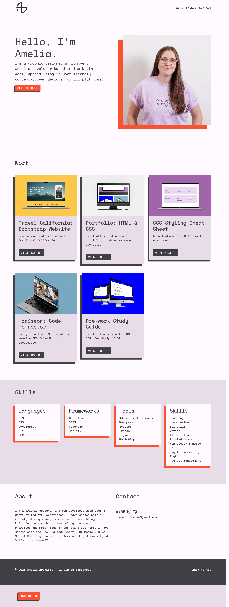

# week-03-challenge-03

## Description

Week 03: Challenge 03 – Bootstrap Portfolio
A new portfolio site built using Bootstrap framework, along with HTML & CSS to showcase all future development projects created by Amelia Bramwell. Using semantic HTML, and things learnt in the course so far, such as Bootstrap, CSS variables, media queries and psuedo elements.

## Installation

N/A

View site at: https://zwirled.github.io/week-03-challenge-03/

## Usage

To use this one page website, please use the navigation within the header to scroll smoothly to relevant sections.

To view the live web applications featured, click the button below the project description.

## Credits

N/A

## License

MIT License

Copyright (c) [2023] [Amelia Bramwell]

Permission is hereby granted, free of charge, to any person obtaining a copy of this software and associated documentation files (the "Software"), to deal in the Software without restriction, including without limitation the rights to use, copy, modify, merge, publish, distribute, sublicense, and/or sell copies of the Software, and to permit persons to whom the Software is furnished to do so, subject to the following conditions:

The above copyright notice and this permission notice shall be included in all copies or substantial portions of the Software.

THE SOFTWARE IS PROVIDED "AS IS", WITHOUT WARRANTY OF ANY KIND, EXPRESS OR IMPLIED, INCLUDING BUT NOT LIMITED TO THE WARRANTIES OF MERCHANTABILITY, FITNESS FOR A PARTICULAR PURPOSE AND NONINFRINGEMENT. IN NO EVENT SHALL THE
AUTHORS OR COPYRIGHT HOLDERS BE LIABLE FOR ANY CLAIM, DAMAGES OR OTHER LIABILITY, WHETHER IN AN ACTION OF CONTRACT, TORT OR OTHERWISE, ARISING FROM, OUT OF OR IN CONNECTION WITH THE SOFTWARE OR THE USE OR OTHER DEALINGS IN THE SOFTWARE.
